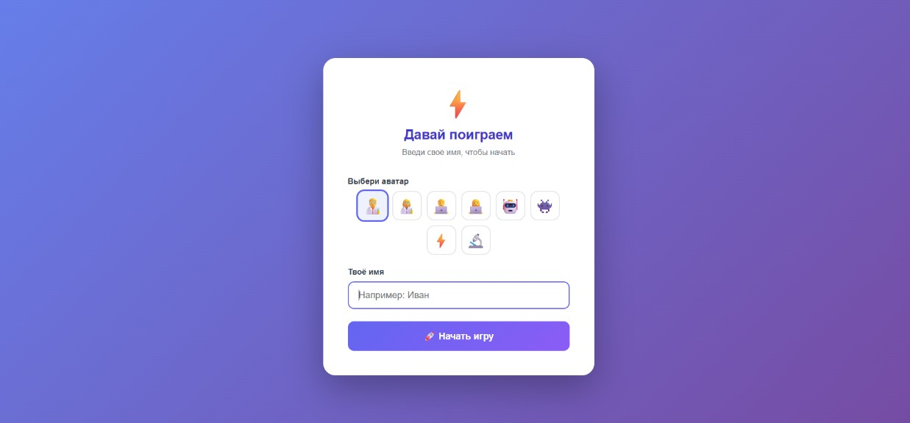
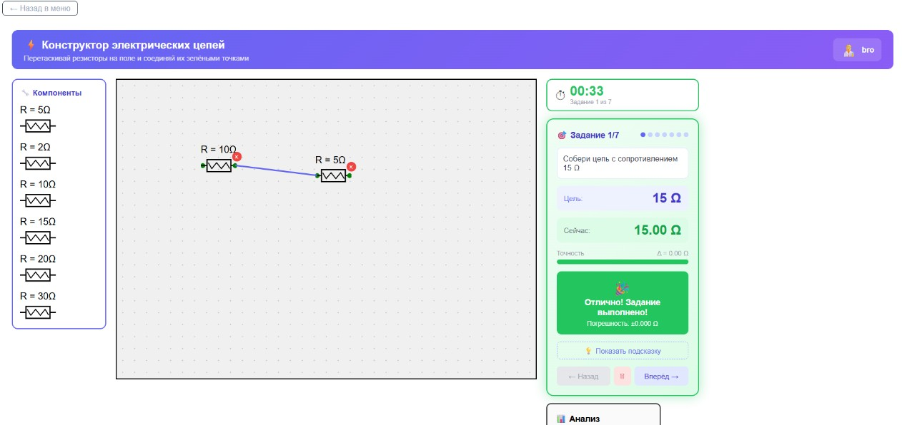

# Resistance — Gamified Training Simulator for Electrical Engineers

**Resistance** is an interactive web application that helps electrical power engineers and technicians practice essential professional skills in a gamified format.

## ✨ Key Features

- 4 unique training modes with different mechanics
- Scoring system and progress saving
- Modern and clean user interface

## 🎮 Training Modes

### 1. Resistor Circuit Assembly
Assemble an electrical circuit from resistors to achieve the target resistance value. Trains understanding of series and parallel connections.

### 2. Occupational Safety
Quiz mode with questions on occupational safety and electrical safety regulations. Helps reinforce knowledge of norms and standards.

### 3. First Aid
Practice providing first medical aid in case of electrical injuries and other emergency situations.

### 4. Emergency Response on Substation
Simulator for actions during various emergency situations at a power substation. Trains correct decision-making and sequence of actions under critical conditions.

## 📸 Screenshots

**Login Screen**  


**Mode 1: Resistor Assembly**  


**Mode 2: Occupational Safety**  


**Mode 3: First Aid**  


**Mode 4: Emergency Response**  


## 🛠 Tech Stack

- React + TypeScript
- Vite
- Tailwind CSS
- localStorage

## 🚀 How to Run Locally

```bash
git clone https://github.com/veterokk8/Resistance.git
cd Resistance
npm install
npm run dev
